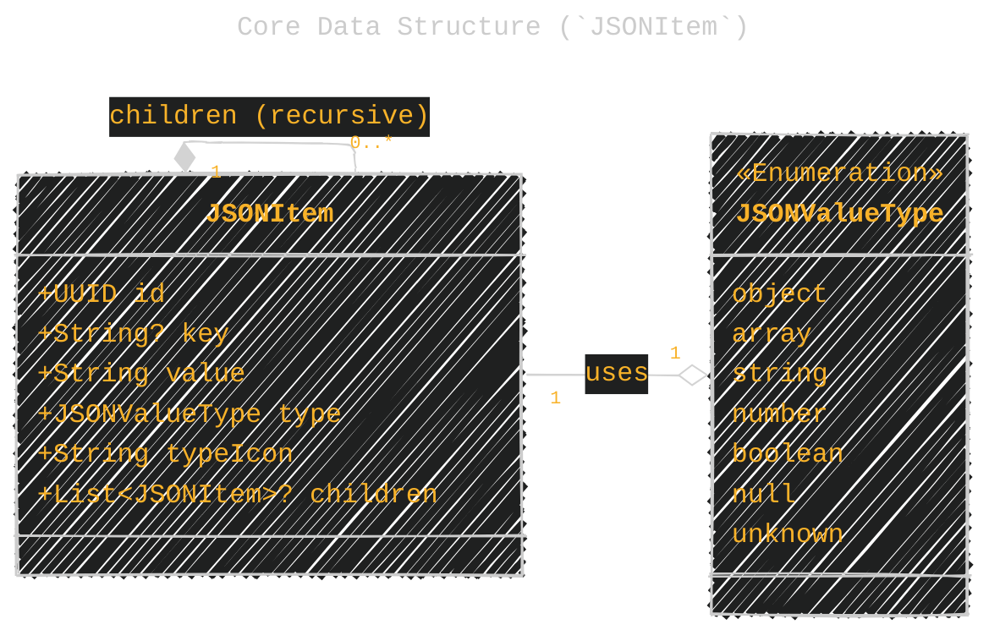
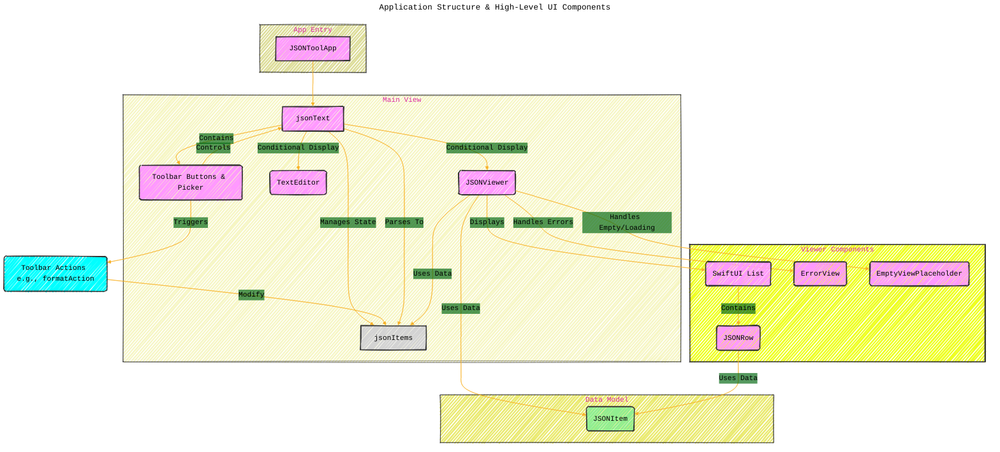
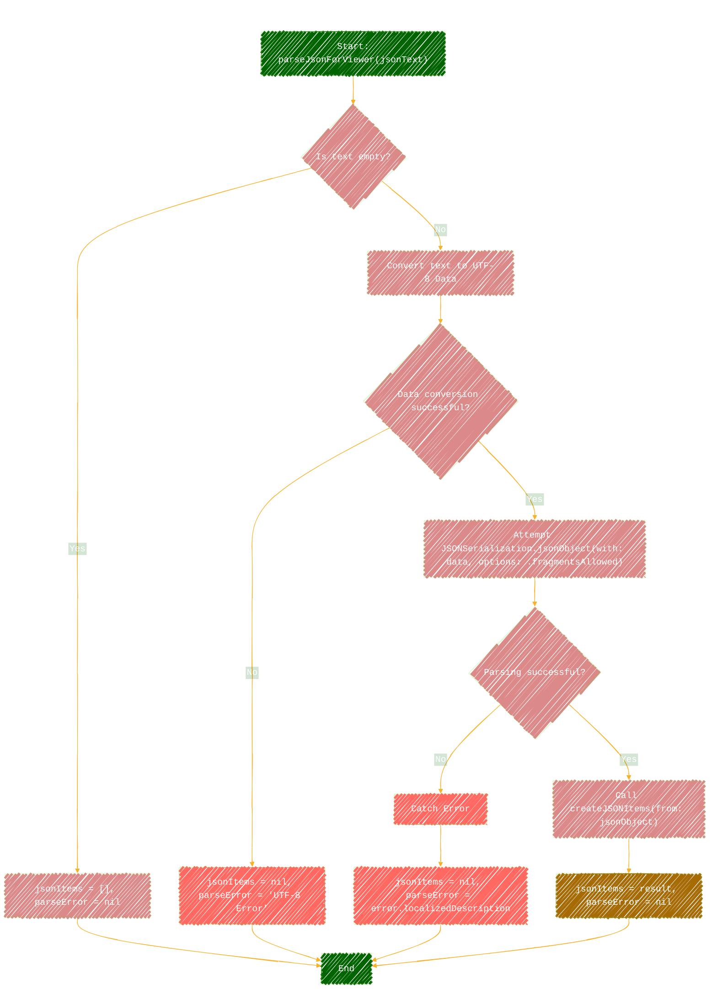
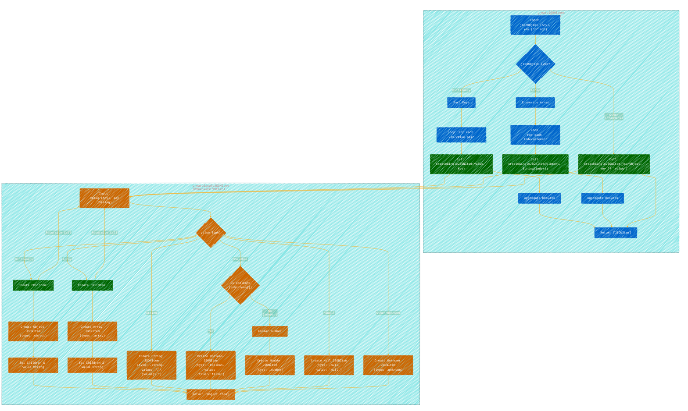
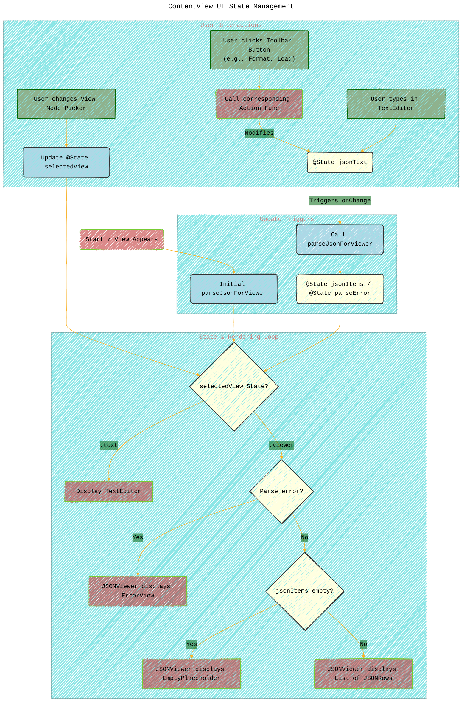
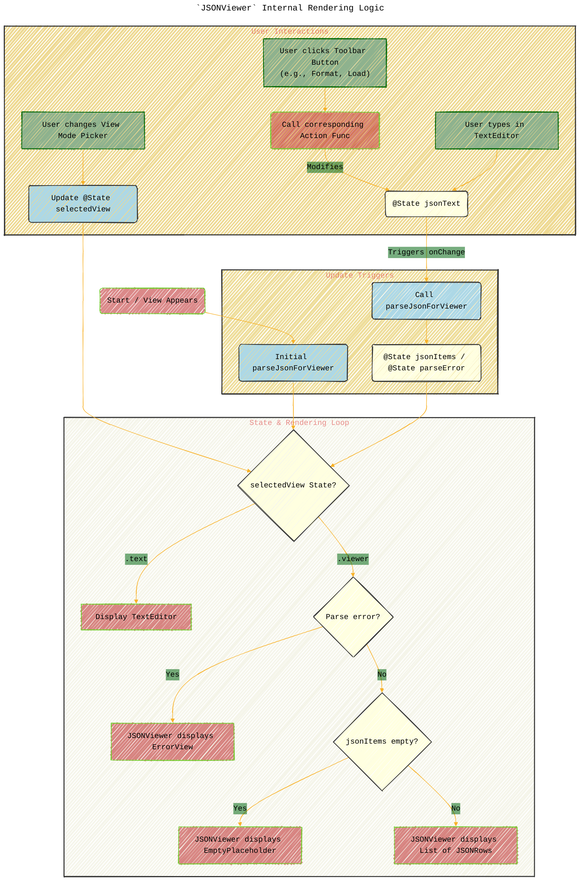

# JSON Insight for SwiftUI - A Diagrammatic Documentation - Visualized Concepts
> **Disclaimer:**
>
> This document contains my personal notes on the topic,
> compiled from publicly available documentation and various cited sources.
> The materials are intended for educational purposes, personal study, and reference.
> The content is dual-licensed:
> 1. **MIT License:** Applies to all code implementations (Swift, Mermaid, and other programming languages).
> 2. **Creative Commons Attribution 4.0 International License (CC BY 4.0):** Applies to all non-code content, including text, explanations, diagrams, and illustrations.
---

Here are several diagrams illustrating the structure, data flow, and logic of the `JSON Insight for SwiftUI` App.

## Diagram 1: Core Data Structure (`JSONItem`)

This class diagram shows the structure of the `JSONItem` struct, which is used to represent nodes in the hierarchical JSON viewer, and its relationship with the `JSONValueType` enum.

**Explanation:**

*   `JSONItem` holds the display data for each element in the JSON tree (key, formatted value, type information, icon, and potential children).
*   `JSONValueType` defines the fundamental types according to the JSON specification.
*   The `children` property indicates the recursive nature, allowing `JSONItem` to represent nested objects and arrays.

---

## Diagram 2: Application Structure & High-Level UI Components

This diagram shows the main application object, the primary view (`ContentView`), and how it orchestrates the display of either the `TextEditor` or the `JSONViewer`.

**Explanation:**

*   `JSONToolApp` is the entry point.
*   `ContentView` is the main UI container, holding the `jsonText` (raw input), `jsonItems` (parsed tree data), and `selectedView` state.
*   Based on `selectedView`, `ContentView` shows either a `TextEditor` for raw input or the `JSONViewer` for the tree view.
*   `JSONViewer` uses `JSONItem` data and helper views (`JSONRow`, `ErrorView`, `EmptyViewPlaceholder`) to render the tree.
*   Toolbar actions modify `jsonText`, which in turn triggers re-parsing and updates `jsonItems`.

---

## Diagram 3: JSON Parsing Flow (`parseJsonForViewer`)

This flowchart illustrates the steps involved in parsing the raw JSON string into the `JSONItem` structure for the viewer.

**Explanation:**

*   The function first checks for empty input.
*   It converts the string to `Data`.
*   `JSONSerialization` is used to parse the data, allowing fragments (top-level non-object/array values).
*   On success, `createJSONItems` is called to build the tree structure.
*   Errors during conversion or parsing result in setting the `parseError` state and clearing `jsonItems`.

----

## Diagram 4: Tree Building Logic (`createJSONItems` / `createSingleJSONItem`)

This flowchart outlines the recursive logic used to traverse the parsed JSON object (`Any`) and build the `[JSONItem]` array.

**Explanation:**

*   `createJSONItems` determines if the root is an object, array, or fragment and delegates the creation of individual items to `createSingleJSONItem`. It sorts dictionary keys for consistent display.
*   `createSingleJSONItem` is the core recursive function:
    *   It checks the type of the input `value`.
    *   For Dictionaries and Arrays, it *recursively calls itself* to build the children list first, then creates the parent `JSONItem`.
    *   For primitive types (String, Number, Boolean, Null), it creates a leaf `JSONItem` with the appropriate type, formatted value string, and icon name.
    *   It handles unknown types defensively.
    *   Crucially, it returns `[JSONItem]?` to consistently handle both single items (like fragments) and collections returned from recursive calls.

----

## Diagram 5: ContentView UI State Management

This diagram shows how the `ContentView` switches between Text and Viewer modes and how actions trigger updates.

**Explanation:**

*   On appear and whenever `jsonText` changes, `parseJsonForViewer` is called.
*   The `selectedView` state dictates whether `TextEditor` or `JSONViewer` is shown.
*   `JSONViewer` internally decides whether to show an error, an empty placeholder, or the list based on the `parseError` and `jsonItems` state.
*   User interactions like changing the picker, clicking buttons, or typing in the editor update the relevant state (`selectedView` or `jsonText`), which then triggers re-parsing or re-rendering loops.

-----

## Diagram 6: `JSONViewer` Internal Rendering Logic

This flowchart describes how the `JSONViewer` decides what to display based on its input `items` and `error`.

**Explanation:**

*   The `JSONViewer` prioritizes showing an error if one exists.
*   If there's no error, it checks if `items` are available (parsed). If not, it shows a "Parsing..." message.
*   If items are available but empty, it shows an "Empty JSON" message.
*   Otherwise, it renders the SwiftUI `List`, configured to handle the hierarchical `children` relationship of `JSONItem`, using `JSONRow` to render each individual item.

---
**Licenses:**

- **MIT License:**   - Full text in [LICENSE](LICENSE) file.
- **Creative Commons Attribution 4.0 International:**  - Legal details in [LICENSE-CC-BY](LICENSE-CC-BY) and at [Creative Commons official site](http://creativecommons.org/licenses/by/4.0/).

---